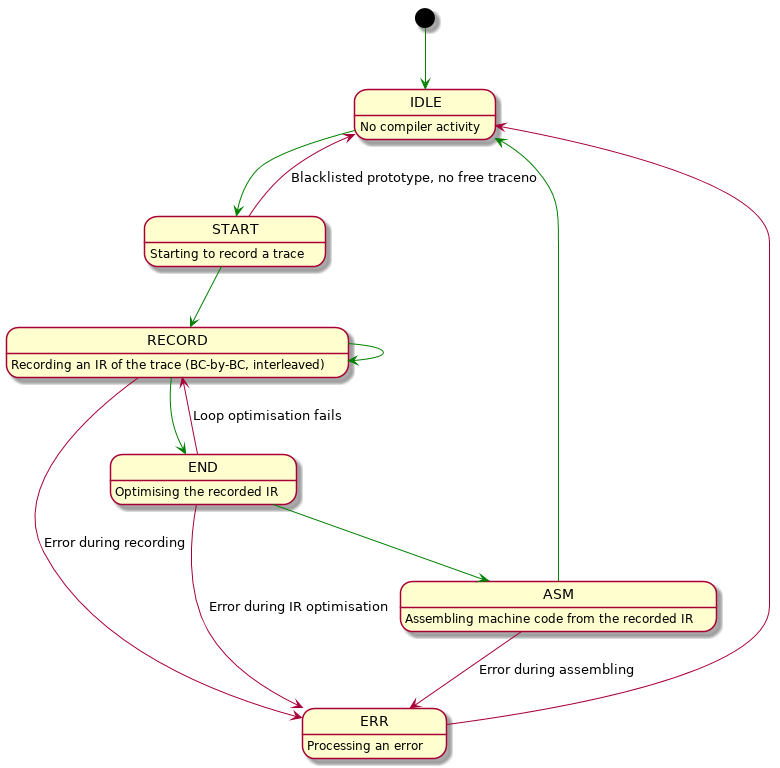

.. _tut-compiler-state:

Tutorial: Compiler's State Machine
==================================

.. contents:: :local:

Introduction
------------

Here is the state diagram of the JIT compiler. States are stored in ``J->state`` at the time of writing (Jan 2018). "Normal" transitions between states are marked with green arrows.

