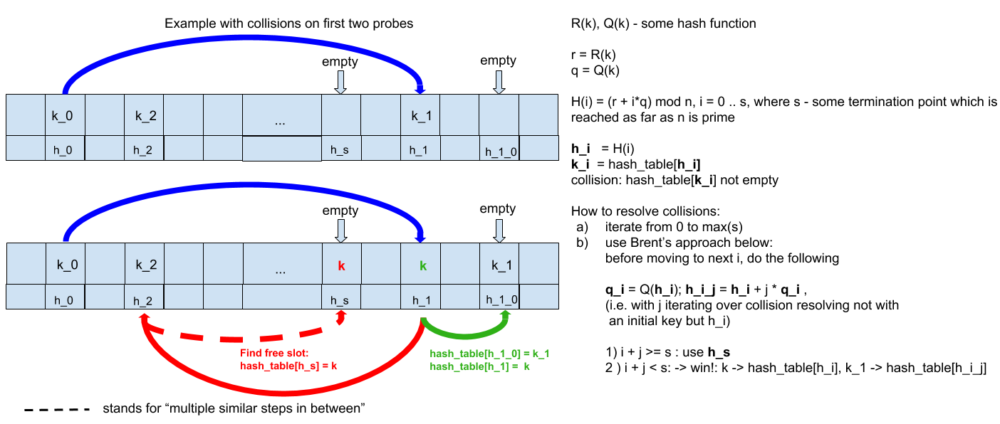
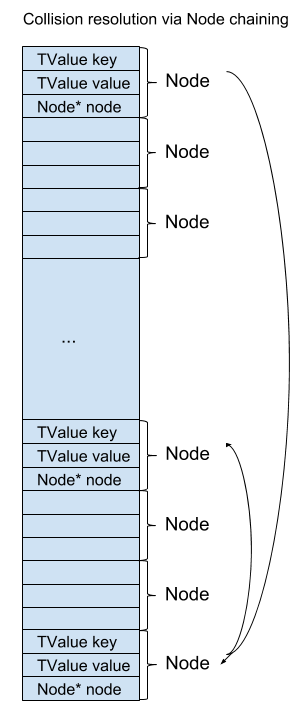
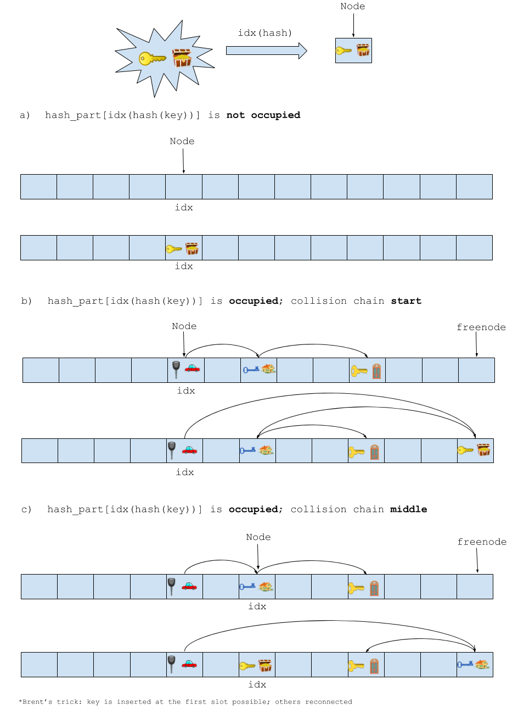

.. _tut-gctab:

Tutorial: GCtab
===============

.. contents:: :local:

GCtab: hash part implementation details
---------------------------------------

See `Brant's trick <https://maths-people.anu.edu.au/~brent/pd/rpb013.pdf>`_.

Iteration
---------

One type of table iteration is handled in VM in ``BC_ITERN``.

Starting part of its code is below with comments on how the instructions and some interesting details pointed out:

.. code-block:: c

    case BC_ITERN:
    |  ins_A    // RA = base, (RB = nresults+1, RC = nargs+1 (2+1))
    |.if JIT
    |  // NYI: add hotloop, record BC_ITERN.
    |.endif
    |  mov TMPa2, KBASE                 // Need two more free registers.
    |  mov TMPa, DISPATCH
    // Table pnt is put into RBa.
    // The following arithmetic is applied here:
    // RA (see above) contains offset from BASE where table object resides.
    // Formula below stands for
    // mov acc, qword [base + off_1*TVS_X2 + (off_2)*TVS]
    // where
    // TVS_X2 == 16
    // TVS_X == 8
    // i.e.
    // qword [base + BASE * 16 - 2*8]
    // where
    // the first part stands  for offset from the BASE of stack
    // moving backwards one TValue (i.e. 16)
    // and qword is 8 bytes.
    // This brings us to the 'first' part of TValue structs in its
    // payload version.
    |  i2gcr TAB:RBa, BASE, RAa, -2
    // Following the previous calculation, it's clear that
    // RC is assigned the 'second', tag value of the same TValue slot
    // This slot is meant to keep control value i.e. iteration counter.
    // NB: tag value of this TValue can be disregarded i.e. it's already
    //   known beforehand that the value under scrutiny is a table.
    |  __i2gcr RC, BASE, RAa, -1
    |  mov DISPATCHd, TAB:RBa->asize
    |  inc_PC
    // KBASE is assigned array part.
    |  mov KBASE, TAB:RBa->array
    |1:  // Traverse array part.
    |  cmp RC, DISPATCHd; jae >5                // Index points after array part?
    // AUX1 is assigned next element in array part.
    |  n2tvp_r AUX1, KBASE, RCa
    // Element in AUX is compared to NIL.
    // Literally, this comparison is: comparing next element in array part to NIL value
    // as array part can contain NIL-s or so-called 'holes'.
    // NB: two important points here:
    // 1. dword is used as array part contains elements of int32_t type
    // 2. AUX + 8 as NIL is basically a TAG (~0). For payload version of TValue
    //   tag resides in the second part in 'value_tag' member.
    //   As this '+' operates on addresses, it stands for '+ 8 bytes'. Thus, it's clear then
    //   that AUX + 8 points to this second part of TValue.
    //   Thus the comparison is actually a check that current TValue is a NIL value.
    //
    // NB: this iteration inspection can help figuring out that actual array size in GCtab is
    //   asize + 1.
    //   If you inspect this code chunk with gdb, it'll be clear that first iteration is jumps to 4
    //   i.e. the very first element of the array i.e. the one in *array is NIL.
    //   Of course, the latter fact can be figured out from the GCtab code as well.
    |  cmp dword [AUX1+8], LJ_TNIL; je >4
    |  cvtsi2sd xmm0, RC
    |  // Copy array slot to returned value.
    |  i2tvp AUX1, BASE, RAa, 1

.. _gstab-tables:

Layout
-------

GCtab struct definition
^^^^^^^^^^^^^^^^^^^^^^^

.. code-block :: c

    struct GCtab {
        GCHeader;
        uint8_t  nomm;
        int8_t   colo;
        uint32_t unused;
        TValue   *array;
        GCtab    *metatable;
        GCobj    *gclist;
        Node     *node;
        size_t   asize;
        size_t   hmask;
        Node     *freetop;
    };

GCtab struct description
^^^^^^^^^^^^^^^^^^^^^^^^

Details
"""""""

To understand what each component stands for, basic table characteristics should be outlined:

            -  table can serve as `an array and a hash-map <https://www.lua.org/manual/5.1/manual.html#2.5.7>`_ at the same time. Thus, it has both array and hash parts.
            -  being a core type in Lua, table has a special functionality of `metatables <https://www.lua.org/manual/5.1/manual.html#2.8>`__ (which is a table itself with keys treated in a special way).

Fields annotation
"""""""""""""""""

After these details, descriptions below should be entirely clear:

.. list-table::
   :widths: 25 50
   :header-rows: 1

   * - Field
     - Description
   * - ``GCHeader``
     - Garbage collection dedicated part of object type in Lua. Used for GC housekeeping purposes (:ref:`layout details <gcheader_gc_gotchas>`).
   * - ``uint8_t nomm``
     - Negative metamethod cache. Array to track whether there is **no** metamethod for a table. It's of fixed size because the set of metamethods is known beforehand.
   * - ``int8_t   colo``
     - Size of collocated array which is a sequential part of a table stores straight after the table object body. Such a trick is utilized in case sequential part is of moderate (i.e. ``asize <= LJ_MAX_COLOSIZE (16)`` ) size. In this case, instead of two allocations (via ``malloc``), just one works out.
   * - ``uint32_t unused``
     - 32-bit padding.
   * - ``TValue *array``
     - Sequential part when it has not been collocated.
   * - ``GCtab *metatable``
     - Metatable.
   * - ``GCobj *gclist``
     - List of :ref:`garbage collectible objects <tut-garbage-gotchas>`.
   * - ``Node *node``
     - Hash part is implemented as a hash table of :ref:`node <Layout-NodestructNode>`'s. For collisions resolution, ``Node`` s' chains are maintained. However, they are stored not within external lists but within hash table itself. Collisions which occur on insertions are resolved with Brent variation of collisions' resolution algorithm (`original paper <http://maths-people.anu.edu.au/~brent/pd/rpb013.pdf>`_, `slides with pictures <http://cseweb.ucsd.edu/~kube/cls/100/Lectures/lec17.brentsordered/lec17.pdf>`_).
   * -  ``size_t asize``
     -  Array part size i.e. count of elements. However, as elements enumeration starts from 1, implementation motivated actual size is ``asize + 1``  (see :ref:`tut-for-iter` for details).
   * - ``size_t hmask``
     -  Mask to get the index in hash array. Technically, ``hsize = 2^i`` → ``hmask = 2^i - 1`` → ``hashed & hmask = hashed mod hsize`` → idx.
   * - ``Node *freetop``
     - When hash part is not empty, keeps pointer to the last node in the Node chain. Used for quick access to the last stored element when adding new keys.

**asize** can be 0 in which case there is no collocated part.

.. image:: images/gstab.png
        :align: center
        :alt: brant
        :width: 200px

Implementation internals
------------------------

Array part
^^^^^^^^^^

<contents pending>
For the array part, key field is unnecessary as sequential indexing is used. 

.. _Layout-Hashpart:

Hash part
^^^^^^^^^

Hash part consists of nodes of the following type:

.. _Layout-NodestructNode:

Node struct
"""""""""""

.. code-block:: c

    /* Hash node. */
        typedef struct Node {
        TValue val;           /* Value object. Must be first field. */
        TValue key;           /* Key object. */
        struct Node* next;    /* Hash chain. Required for collision resolving. */
    } Node;

Hash implementation internals
"""""""""""""""""""""""""""""

On lookup, key is searched first in the slot by ``idx(hash(key))`` and
further look-up is proceeded through the chain of ``Node``-s:

On insertion, collisions are resolved in the following way:

